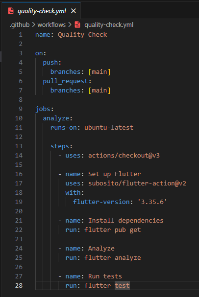

# Examen Unidad 3 - Automatización de Calidad con GitHub Actions

## Información del Estudiante
- **Curso:** Soluciones Moviles II
- **Tema:** Automatización de calidad con GitHub Actions
- **Fecha:** 18 de Noviembre de 2025
- **Estudiante:** Jesús Eduardo Agreda Ramirez

## Repositorio
- **URL:** https://github.com/mangoesafterplay/SM2_ExamenUnidad3.git

## Estructura General del Proyecto
```
SM2_ExamenUnidad3/
├── .github/
│   └── workflows/
│       └── quality-check.yml
├── test/
│   └── main_test.dart
├── lib/
│   ├── services/
│   │   ├── auth_service.dart
│   │   └── session_service.dart
│   └── [más código del proyecto]
├── pubspec.yaml
└── README.md
```

## Evidencias

### 1. Estructura de Carpetas


*Carpeta .github/workflows/ y test/ creadas correctamente*

### 2. Contenido de quality-check.yml


*Archivo de workflow configurado con Flutter 3.19.0*

### 3. Ejecución Exitosa del Workflow


*Workflow ejecutado al 100% - PASSED (6/6 tests)*

## Explicación de la Implementación

### Descripción del Proyecto

**MovUni** es una aplicación móvil desarrollada en Flutter para la Universidad Privada de Tacna que permite gestionar el transporte universitario entre conductores y pasajeros.

### Workflow de GitHub Actions

El workflow `quality-check.yml` automatiza dos procesos críticos de calidad:

#### 1. Análisis estático de código (`flutter analyze`)
- Verifica convenciones de código de Dart/Flutter
- Detecta errores sintácticos y warnings
- Valida imports innecesarios
- Asegura buenas prácticas de programación
- Identifica código muerto o no utilizado

#### 2. Ejecución de pruebas automatizadas (`flutter test`)
- Ejecuta todas las pruebas en la carpeta `test/`
- Valida el correcto funcionamiento de los servicios
- Detecta regresiones en el código
- Verifica la lógica de negocio

### Pruebas Implementadas en main_test.dart

El archivo `main_test.dart` contiene **6 pruebas unitarias** organizadas en 2 grupos:

#### **Grupo 1: AuthService (3 pruebas)**

1. **Validación de email institucional**
   - Verifica que se rechacen emails que no sean del dominio @virtual.upt.pe
   - Lanza una excepción si el email es inválido
   - Asegura que solo usuarios institucionales puedan registrarse

2. **Registro de usuario con email válido**
   - Crea un nuevo usuario con MockFirebaseAuth
   - Valida que el usuario sea de tipo `User`
   - Confirma que el email se guarda correctamente

3. **Cierre de sesión**
   - Inicia sesión con un usuario de prueba
   - Verifica que `currentUser` no sea null después del login
   - Ejecuta `signOut()` y confirma que `currentUser` sea null

#### **Grupo 2: SessionService (3 pruebas)**

4. **Guardar y obtener rol de usuario**
   - Guarda el rol 'conductor' en SharedPreferences
   - Recupera el rol guardado
   - Valida que el rol sea exactamente 'conductor'

5. **Rol no guardado devuelve null**
   - Verifica el comportamiento cuando no hay datos guardados
   - Asegura que no haya valores por defecto inesperados
   - Confirma que `getUserRole()` devuelve null

6. **Eliminar rol de usuario**
   - Guarda un rol 'pasajero'
   - Ejecuta `clearUserRole()`
   - Verifica que el rol se haya eliminado correctamente

### Tecnologías y Herramientas Utilizadas

- **Flutter:** Framework de desarrollo móvil
- **Firebase Auth:** Autenticación de usuarios
- **Firebase Firestore:** Base de datos en tiempo real
- **SharedPreferences:** Almacenamiento local de datos
- **Mockito & firebase_auth_mocks:** Mocks para testing
- **GitHub Actions:** CI/CD automatizado

### Configuración del Workflow
```yaml
Trigger: push y pull_request en rama main
Sistema: Ubuntu Latest
Flutter: 3.19.0
Pasos:
  1. Checkout del código
  2. Configuración de Flutter
  3. Instalación de dependencias (flutter pub get)
  4. Análisis de código (flutter analyze)
  5. Ejecución de pruebas (flutter test)
```

### Ventajas de la Implementación

**Detección temprana de errores:** Los bugs se identifican antes de llegar a producción

**Calidad de código garantizada:** flutter analyze asegura que el código cumpla estándares

**Automatización completa:** No se requiere intervención manual

**Feedback inmediato:** Los desarrolladores saben en segundos si algo falló

**Prevención de regresiones:** Los tests aseguran que el código nuevo no rompa funcionalidad existente

**Integración continua:** Cada commit es validado automáticamente

## Resultados

| Métrica | Resultado |
|---------|-----------|
| **Workflow Status** | PASSED (100%) |
| **Flutter Analyze** | Sin errores ni warnings |
| **Tests Ejecutados** | 6/6 exitosos |
| **Cobertura** | AuthService + SessionService |
| **Tiempo de Ejecución** | ~2 minutos |

## Cómo Ejecutar Localmente

### Requisitos previos
- Flutter SDK 3.19.0 o superior
- Git instalado
- Cuenta de GitHub

### Pasos
```bash
# 1. Clonar el repositorio
git clone https://github.com/TU_USUARIO/SM2_ExamenUnidad3.git
cd SM2_ExamenUnidad3

# 2. Instalar dependencias
flutter pub get

# 3. Ejecutar análisis de código
flutter analyze

# 4. Ejecutar todas las pruebas
flutter test

# 5. Ejecutar solo main_test.dart
flutter test test/main_test.dart

# 6. Ejecutar con cobertura
flutter test --coverage
```

## Detalles Técnicos

### Dependencias del Proyecto
```yaml
dependencies:
  firebase_core: ^2.24.2
  firebase_auth: ^4.15.3
  cloud_firestore: ^4.13.6
  shared_preferences: ^2.2.2

dev_dependencies:
  flutter_test: sdk: flutter
  firebase_auth_mocks: ^0.14.0
  fake_cloud_firestore: ^2.4.0
```

### Mocks Utilizados

- **MockFirebaseAuth:** Simula Firebase Authentication sin necesidad de conexión real
- **FakeFirestore:** Simula Firestore Database
- **SharedPreferences Mock:** Simula almacenamiento local

## Conclusiones

La implementación de GitHub Actions en el proyecto MovUni ha permitido:

1. **Automatizar la validación de código:** Cada cambio es revisado automáticamente
2. **Mantener alta calidad:** El código cumple con estándares de Flutter/Dart
3. **Prevenir errores en producción:** Los tests atrapan bugs antes del despliegue
4. **Mejorar la colaboración:** Los pull requests muestran claramente si pasan las pruebas
5. **Implementar DevOps:** Integración continua funcional desde el día uno
6. **Documentar el comportamiento esperado:** Los tests sirven como documentación viva

### Aprendizajes

- Configuración de workflows en GitHub Actions
- Implementación de pruebas unitarias con mocks
- Análisis estático de código con flutter analyze
- Buenas prácticas de DevOps en proyectos móviles
- Integración de Firebase con testing

---

**Repositorio:** https://github.com/mangoesafterplay/SM2_ExamenUnidad3.git
